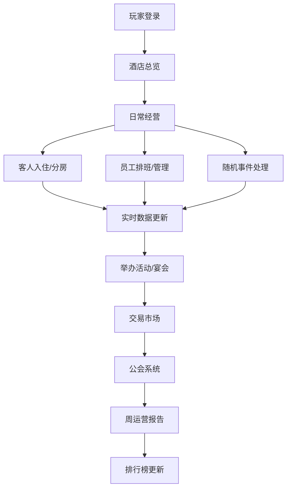

## 1. 产品概述

多人在线豪华酒店经营与度假村管理系统，玩家创建经营个性化酒店，招聘员工，服务客人，与其他玩家交易和合作，打造全球顶级的酒店帝国。

- 主要目的：提供一个深度模拟经营的多人在线游戏，融合策略管理、社交互动和经济系统
- 解决问题：单一经营游戏缺乏多人互动和社交深度，本系统提供完整的玩家生态系统
- 目标用户：经营策略游戏爱好者、模拟经营玩家、社交游戏玩家

## 2. 核心功能

### 2.1 用户角色

| 角色 | 注册方式 | 核心权限 |
|------|----------|----------|
| 玩家 | 游戏内注册/登录 | 创建酒店、招聘员工、经营管理、交易市场、加入公会、查看排行榜 |
| 系统管理员 | 后台管理 | 全服数据监控、活动配置、经济调控、玩家管理 |

### 2.2 功能模块

1. **酒店创建与管理页面**：风格选择、房间配置、装修设施、舒适度评分、定价策略
2. **员工管理页面**：招聘、技能提升、满意度管理、排班调度、晋升审批
3. **运营中心页面**：客人入住、自动分房、随机事件处理、能耗监控、实时数据
4. **活动与宴会页面**：派对/宴会筹备、参与人数预测、收入计算、服务评分
5. **交易市场页面**：酒店蓝图交易、稀有食材交易、智能定价建议、全服公告
6. **公会系统页面**：联合度假村建设、全员贡献、升级加成、成员管理
7. **数据分析页面**：周运营报告、入住率曲线、餐饮收入热力图、员工满意度趋势、PDF导出
8. **排行榜页面**：酒店评分排名、总收入排名、客房数排名、玩家酒店查看

### 2.3 页面详情

| 页面名称 | 模块名称 | 功能描述 |
|----------|----------|----------|
| 酒店创建与管理 | 风格选择器 | 古典/现代/热带三种风格，实时预览效果 |
| 酒店创建与管理 | 房间配置 | 豪华套房/标准间/别墅，数量与布局调整 |
| 酒店创建与管理 | 装修设施 | 家具、装饰、设施搭配，影响舒适度评分 |
| 酒店创建与管理 | 评分系统 | 自动计算舒适度评分，智能定价策略建议 |
| 员工管理 | 招聘中心 | 前台/厨师/清洁工等职位招聘，展示技能与薪资 |
| 员工管理 | 技能面板 | 员工技能等级、培训提升、满意度条 |
| 员工管理 | 排班系统 | 可视化排班表、疲劳度监控、晋升审批流程 |
| 运营中心 | 入住面板 | 客人列表、偏好标签、自动分房算法 |
| 运营中心 | 实时监控 | 客房占用率仪表盘、能耗监控、员工疲劳度 |
| 运营中心 | 事件处理 | 随机事件弹窗（投诉/故障/婚礼），手动响应选项 |
| 活动与宴会 | 活动筹备 | 派对/宴会类型选择、预算设置、筹备进度条 |
| 活动与宴会 | 实时数据 | 参加人数预测、实时收入、服务评分反馈 |
| 交易市场 | 商品列表 | 酒店蓝图、稀有食材，展示卖家、价格、稀有度 |
| 交易市场 | 定价助手 | 近7天成交均价图表、建议价格区间、历史成交 |
| 交易市场 | 全服公告 | 重大成交实时滚动公告栏 |
| 公会系统 | 联合度假村 | 度假村3D预览、等级进度、加成效果展示 |
| 公会系统 | 贡献系统 | 资金贡献排行、升级需求、成员列表 |
| 数据分析 | 报告总览 | 周运营报告摘要、关键指标卡片 |
| 数据分析 | 图表系统 | 入住率折线图、餐饮收入热力图、满意度趋势、雷达图 |
| 数据分析 | PDF导出 | 一键导出带图表的完整PDF报告 |
| 排行榜 | 排名列表 | 酒店评分/总收入/客房数三个榜单，实时更新 |
| 排行榜 | 详情查看 | 查看其他玩家酒店布局、员工阵容、经营数据 |

## 3. 核心流程

玩家登录后进入酒店总览，可进行日常经营管理。每日系统自动生成客人、随机触发事件，玩家通过合理分配资源和应对事件提升酒店评分和收入。玩家可参与交易市场、加入公会获得加成，每周系统生成运营报告，全服排行榜实时更新。

## 4. 用户界面设计

### 4.1 设计风格

- **主色调**：深金色 (#C9A962) 作为主色，深海军蓝 (#1A2332) 作为背景色，体现奢华酒店气质
- **辅助色**：珊瑚橙 (#FF6B4A) 用于高亮和CTA按钮，翡翠绿 (#2ECC71) 用于正向指标，酒红色 (#8B2635) 用于警告和负向指标
- **按钮风格**：圆角12px，带微渐变和发光效果，hover时有优雅的浮起动画
- **字体**：标题使用 Playfair Display（优雅衬线体），正文使用 Manrope（现代无衬线体）
- **布局风格**：卡片式布局，玻璃拟态效果（backdrop-blur），大量阴影层次营造深度
- **图标风格**：线性图标配合金色渐变描边，使用 lucide-react 库

### 4.2 页面设计概述

| 页面名称 | 模块名称 | UI元素 |
|----------|----------|----------|
| 酒店总览 | 顶部导航栏 | 玻璃拟态背景、金色Logo、玩家信息、金币显示、通知中心 |
| 酒店总览 | 数据仪表盘 | 数据卡片、环形进度条、实时趋势小图表、动画数字跳动 |
| 酒店总览 | 酒店3D预览 | 可旋转酒店模型、风格切换预览、点击房间查看详情 |
| 酒店总览 | 侧边菜单 | 折叠式导航、图标+文字、当前页金色高亮指示 |
| 员工管理 | 员工卡片 | 头像、技能雷达图、满意度条、状态指示灯（疲劳/在岗/休息） |
| 运营中心 | 事件弹窗 | 动画弹出、事件图标、选项按钮、倒计时效果 |
| 数据分析 | 图表区 | 渐变填充折线图、热力地图、雷达图、交互式悬停提示 |
| 排行榜 | 排名卡片 | 前三名特殊金色/银色/铜色边框、头像、关键数据、查看详情按钮 |

### 4.3 响应式

- Desktop-first设计，最小支持1280px宽度
- 平板端（768px-1280px）：侧边栏收起为图标模式，图表自适应缩放
- 移动端（<768px）：顶部导航简化，卡片单列排列，底部Tab导航

### 4.4 动效设计

- 页面切换：淡入+左滑过渡，300ms ease-out
- 卡片悬浮：轻微上浮3px+阴影加深，200ms过渡
- 数据更新：数字跳动动画（TweenMax效果）
- 事件通知：顶部滑入+轻微震动效果
- 加载动画：金色渐变旋转圆环
