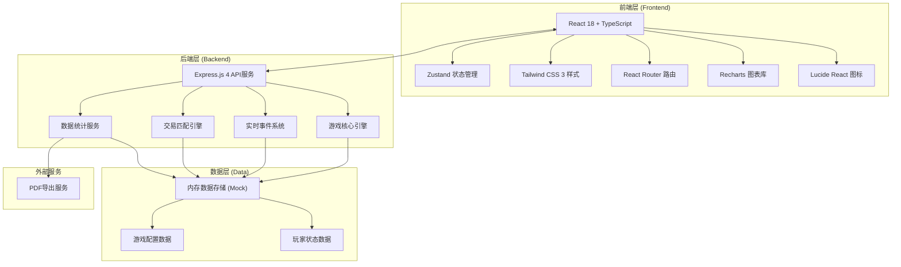
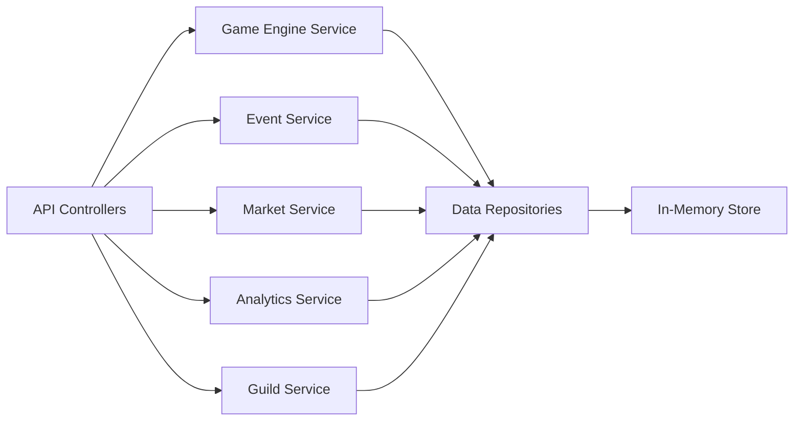
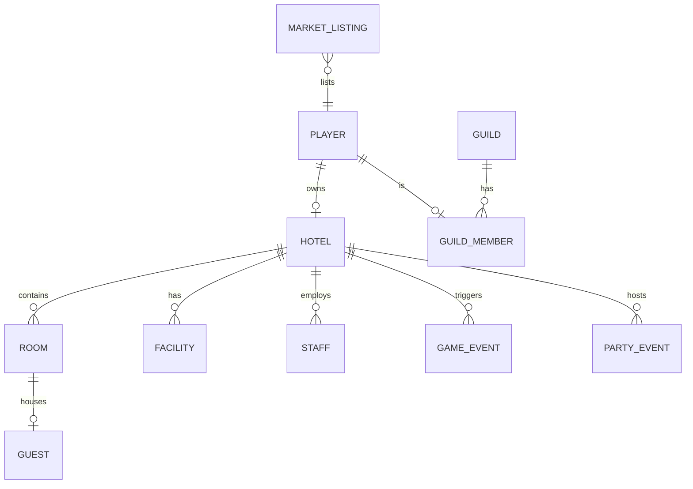

## 1. 架构设计



## 2. 技术描述

- **前端**：React@18 + TypeScript + Vite + TailwindCSS@3 + Zustand + React Router DOM + Recharts + Lucide React
- **初始化工具**：vite-init
- **后端**：Express@4 + TypeScript
- **数据库**：内存数据存储（Mock数据，模拟多人在线环境）
- **PDF导出**：jsPDF + html2canvas 前端导出方案

## 3. 路由定义

| 路由 | 页面名称 | 用途 |
|------|----------|------|
| / | 登录/首页 | 玩家登录入口，酒店帝国概览 |
| /dashboard | 酒店总览 | 核心数据仪表盘、酒店预览、快捷操作 |
| /hotel | 酒店管理 | 风格选择、房间配置、装修设施、舒适度评分 |
| /staff | 员工管理 | 招聘中心、员工列表、排班调度、晋升审批 |
| /operations | 运营中心 | 客人入住、实时监控、随机事件处理 |
| /events | 活动宴会 | 派对/宴会筹备、实时数据追踪 |
| /market | 交易市场 | 蓝图/食材交易、定价助手、全服公告 |
| /guild | 公会系统 | 联合度假村、贡献系统、成员管理 |
| /analytics | 数据分析 | 周运营报告、数据可视化、PDF导出 |
| /leaderboard | 排行榜 | 酒店排名、总收入排名、客房数排名 |

## 4. API 定义

```typescript
// 玩家相关
interface Player {
  id: string;
  name: string;
  avatar: string;
  coins: number;
  level: number;
  exp: number;
  guildId?: string;
}

// 酒店相关
interface Hotel {
  id: string;
  playerId: string;
  name: string;
  style: 'classical' | 'modern' | 'tropical';
  rooms: Room[];
  facilities: Facility[];
  comfortScore: number;
  rating: number;
  totalRevenue: number;
}

interface Room {
  id: string;
  type: 'suite' | 'standard' | 'villa';
  number: string;
  floor: number;
  price: number;
  comfort: number;
  status: 'vacant' | 'occupied' | 'maintenance';
  guestId?: string;
}

interface Facility {
  id: string;
  type: 'pool' | 'spa' | 'restaurant' | 'gym' | 'lounge';
  level: number;
  quality: number;
}

// 员工相关
interface Staff {
  id: string;
  hotelId: string;
  name: string;
  avatar: string;
  position: 'receptionist' | 'chef' | 'cleaner' | 'manager';
  skills: {
    service: number;
    efficiency: number;
    friendliness: number;
    professionalism: number;
  };
  satisfaction: number;
  fatigue: number;
  salary: number;
  level: number;
  status: 'working' | 'resting' | 'off';
  schedule: ScheduleItem[];
}

interface ScheduleItem {
  day: number;
  shift: 'morning' | 'afternoon' | 'night' | 'off';
}

// 客人相关
interface Guest {
  id: string;
  name: string;
  avatar: string;
  preferences: string[];
  budget: number;
  satisfaction: number;
  checkIn?: Date;
  checkOut?: Date;
  roomId?: string;
}

// 事件相关
interface GameEvent {
  id: string;
  hotelId: string;
  type: 'complaint' | 'malfunction' | 'wedding' | 'vip_arrival';
  title: string;
  description: string;
  options: EventOption[];
  createdAt: Date;
  expiresAt: Date;
  resolved?: boolean;
}

interface EventOption {
  id: string;
  label: string;
  cost?: number;
  effect: {
    rating?: number;
    satisfaction?: number;
    coins?: number;
  };
}

// 活动相关
interface PartyEvent {
  id: string;
  hotelId: string;
  type: 'party' | 'banquet' | 'wedding_reception';
  name: string;
  budget: number;
  attendees: number;
  maxAttendees: number;
  revenue: number;
  serviceScore: number;
  preparationProgress: number;
  status: 'planning' | 'ongoing' | 'completed';
  startTime: Date;
}

// 交易相关
interface MarketListing {
  id: string;
  sellerId: string;
  sellerName: string;
  itemType: 'blueprint' | 'ingredient';
  itemName: string;
  itemRarity: 'common' | 'rare' | 'epic' | 'legendary';
  price: number;
  suggestedPriceMin: number;
  suggestedPriceMax: number;
  createdAt: Date;
  expiresAt: Date;
}

// 公会相关
interface Guild {
  id: string;
  name: string;
  leaderId: string;
  members: GuildMember[];
  resortLevel: number;
  totalContribution: number;
  visitorBonus: number;
  revenueBonus: number;
}

interface GuildMember {
  playerId: string;
  playerName: string;
  contribution: number;
  joinDate: Date;
}

// 报表相关
interface WeeklyReport {
  weekStart: Date;
  weekEnd: Date;
  occupancyRate: number[];
  revenueByDay: { date: string; amount: number }[];
  foodRevenueHeatmap: { day: number; hour: number; value: number }[];
  staffSatisfactionTrend: { date: string; value: number }[];
  radarData: {
    service: number;
    comfort: number;
    food: number;
    facilities: number;
    value: number;
    location: number;
  };
}
```

## 5. 服务器架构



## 6. 数据模型

### 6.1 实体关系图



### 6.2 核心配置数据

```typescript
// 酒店风格配置
const HOTEL_STYLES = {
  classical: {
    name: '古典风格',
    baseComfort: 70,
    priceMultiplier: 1.2,
    buildCost: 50000,
    decor: ['水晶吊灯', '大理石地板', '古董家具', '丝绸窗帘']
  },
  modern: {
    name: '现代风格',
    baseComfort: 65,
    priceMultiplier: 1.0,
    buildCost: 40000,
    decor: ['智能控制', '极简设计', '落地窗', '艺术装置']
  },
  tropical: {
    name: '热带风格',
    baseComfort: 75,
    priceMultiplier: 1.3,
    buildCost: 60000,
    decor: ['无边泳池', '热带花园', '露天餐厅', '水上别墅']
  }
};

// 房间类型配置
const ROOM_TYPES = {
  standard: {
    name: '标准间',
    basePrice: 500,
    baseComfort: 50,
    capacity: 2,
    size: 35
  },
  suite: {
    name: '豪华套房',
    basePrice: 1500,
    baseComfort: 80,
    capacity: 2,
    size: 80
  },
  villa: {
    name: '别墅',
    basePrice: 5000,
    baseComfort: 95,
    capacity: 6,
    size: 250
  }
};

// 员工职位配置
const STAFF_POSITIONS = {
  receptionist: {
    name: '前台',
    baseSalary: 5000,
    skills: ['service', 'friendliness', 'professionalism'],
    impactRoom: 0.15
  },
  chef: {
    name: '厨师',
    baseSalary: 8000,
    skills: ['efficiency', 'service', 'professionalism'],
    impactFood: 0.3
  },
  cleaner: {
    name: '清洁工',
    baseSalary: 3500,
    skills: ['efficiency', 'service'],
    impactCleanliness: 0.25
  },
  manager: {
    name: '经理',
    baseSalary: 15000,
    skills: ['professionalism', 'service', 'efficiency', 'friendliness'],
    impactOverall: 0.2
  }
};
```
